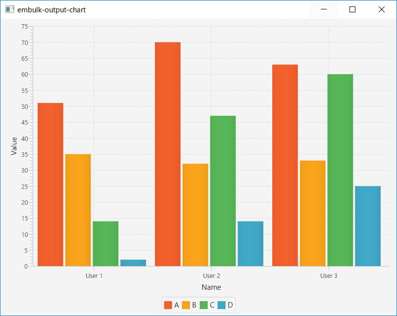
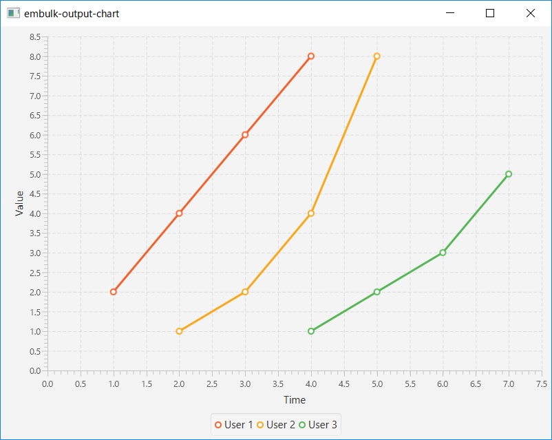

# Chart output plugin for Embulk

Display chart with Java FX.

## Overview

* **Plugin type**: output
* **Load all or nothing**: no
* **Resume supported**: no
* **Cleanup supported**: yes

## Configuration

- **chart_type**: description (enum, required)
    - BAR
    - LINE
    - SCATTER
    - STACKED_BAR
- **x_axis_type**: description (enum, required)
    - NUMBER
    - CATEGORY
- **x_axis_name**: description (string, required)
- **y_axis_type**: description (enum, required)
    - NUMBER
    - CATEGORY
- **x_axis_name**: description (string, required)
- **serieses**: description (SeriesesConfig, required)
    - **name**: series name (string, required)
    - **x**: column name of x axis value (string, required)
    - **y**: column name of y axis value (string, required)
- **series_mapping_rule**: description (SeriesesMappingRuleConfig, required)
    - **column**: column name (string, required)
    - **value**: column で指定した列の値がこの値と等しい場合、series で指定したシリーズにデータを登録する (string, required)
    - **series**: series name (string, required)

## Limitation

- Only on `Local Executor Plugin`
- You need set `1` to `max_threads` and `min_output_tasks`


```yaml
exec:
  max_threads: 1
  min_output_tasks: 1
```

## Example

### 各シリーズで数が同じ場合

例えばこんな CSV ファイルの場合。

```csv
Value A,Value B Value C,Value D,Name
51,35,14,02,User 1
70,32,47,14,User 2
63,33,60,25,User 3
```

config.yml

```yaml
out:
  type: chart
  chart_type: BAR
  x_axis_name: Name
  x_axis_type: CATEGORY
  y_axis_name: Value
  y_axis_type: NUMBER
  serieses:
    - {name: A, x: Name, y: Value A}
    - {name: B, x: Name, y: Value B}
    - {name: C, x: Name, y: Value C}
    - {name: D, x: Name, y: Value D}
```




### 各シリーズで数が違う場合

例えばこんな CSV ファイルの場合。

```csv
Time,Value,Name
1,2,User 1
2,1,User 2
2,4,User 1
3,2,User 2
3,6,User 1
4,1,User 3
4,4,User 2
4,8,User 1
5,2,User 3
5,8,User 2
6,3,User 3
7,5,User 3
```

config.yml

```yaml
out:
  type: chart
  chart_type: LINE
  x_axis_name: Time
  x_axis_type: NUMBER
  y_axis_name: Value
  y_axis_type: NUMBER
  serieses:
    - {name: User 1, x: Time, y: Value}
    - {name: User 2, x: Time, y: Value}
    - {name: User 3, x: Time, y: Value}
  series_mapping_rule:
    - {column: Name, value: User 1, series: User 1} # Name 列の値が `User 1` であれば、シリーズ `User 1` のデータに登録する
    - {column: Name, value: User 2, series: User 2}
    - {column: Name, value: User 3, series: User 3}
```




## Build

```
$ ./gradlew gem  # -t to watch change of files and rebuild continuously
```
